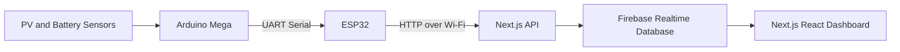

# Smart Photovoltaic Off-grid System


An end-to-end IoT monitoring platform for off-grid photovoltaic systems. This project combines embedded acquisition (Arduino Mega + ESP32), real-time cloud synchronization (Firebase), and a responsive web dashboard (Next.js/React) to monitor critical energy parameters such as voltage, current, and temperature.

[Image of project dashboard]

## 1. Project Overview

This PFE project addresses a core challenge in off-grid solar deployments: obtaining reliable, real-time visibility into system health and power behavior.

The platform continuously measures photovoltaic and battery variables from physical sensors, forwards telemetry through a microcontroller gateway, and visualizes the data through an interactive dashboard for fast engineering decisions.

Technical objective:
- Build a modular and scalable architecture that bridges low-level hardware signals with high-level analytics.
- Improve reliability and safety by monitoring thermal and electrical indicators in near real time.
- Provide a professional-grade interface suitable for technical operations and engineering review.

## 2. Key Features

- ⚡ Real-time acquisition of solar and battery measurements (voltage/current).
- 🌡️ Continuous temperature tracking for thermal risk monitoring.
- 📡 Hardware-to-cloud telemetry pipeline using Arduino Mega and ESP32.
- 📊 Live interactive charts using Recharts for trend analysis.
- 🧠 Normalized sensor payload processing through API routes.
- 🔄 Firebase Realtime Database synchronization for current and historical data.
- 🧪 Built-in support for testing and simulation workflows during development.
- 📱 Responsive dashboard experience for desktop and mobile access.

## 3. System Architecture

The communication chain is designed for robustness and clear separation of responsibilities:

1. Sensors read photovoltaic and battery variables (voltage, current, temperature).
2. Arduino Mega performs primary data acquisition and serial formatting.
3. ESP32 receives serial data and publishes telemetry over Wi-Fi to the web/API layer.
4. Next.js API routes validate and normalize payloads, then sync to Firebase.
5. React dashboard consumes real-time data from Firebase and renders live charts.



[Image of system architecture]

## 4. Technology Stack

| Layer | Technologies | Role |
|---|---|---|
| Hardware | Arduino Mega, ESP32, voltage/current sensors, temperature sensor | Sensor interfacing, local processing, wireless telemetry |
| Frontend/Web | Next.js, React, Recharts | User interface, real-time visualization, dashboard interactions |
| Backend/Database | Next.js API routes, Firebase Realtime Database | Data ingestion, normalization, persistence, real-time access |

## 5. How to Run Locally

### Prerequisites

- Node.js 18+
- npm
- Arduino IDE (or PlatformIO) for firmware upload
- A Firebase Realtime Database project

### Steps

1. Clone the repository and install dependencies:

```bash
git clone <your-repository-url>
cd my-website
npm install
```

2. Configure environment variables:

```bash
# macOS/Linux
cp .env.example .env.local

# Windows PowerShell
Copy-Item .env.example .env.local
```

3. Update `.env.local` with Firebase values:

```env
NEXT_PUBLIC_API_URL=http://localhost:3000
FIREBASE_RTDB_URL=https://<your-firebase-project>.europe-west1.firebasedatabase.app
NEXT_PUBLIC_FIREBASE_RTDB_URL=https://<your-firebase-project>.europe-west1.firebasedatabase.app
```

4. Start the development server:

```bash
npm run dev
```

5. Open the dashboard:

```text
http://localhost:3000
```

6. Upload firmware to boards:

- Flash `Arduino_Mega_Temperature_Sensor.ino` to Arduino Mega.
- Flash `ESP32_Battery_Temperature_Example.ino` to ESP32.
- In ESP32 firmware, set Wi-Fi credentials and API endpoint:
  `http://<your-local-ip>:3000/api/sensor-data`.

[Image of local setup wiring]

## 6. Future Improvements

- 🤖 Predictive maintenance with edge/cloud ML models for anomaly detection on thermal/electrical signatures.
- 🔐 Secure device provisioning and OTA firmware updates (certificate-based authentication).
- 📈 Digital twin and optimization engine for energy yield forecasting and battery life extension.

---

### Engineering Value

This project demonstrates practical skills expected in engineering internships:

- Embedded systems integration (Arduino + ESP32)
- IoT communication pipelines and cloud sync
- Full-stack web engineering with data visualization
- System-level thinking across hardware, software, and operations
