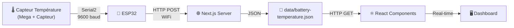

# 🔋 Intégration Température Batterie - Guide Complet

## 📝 Résumé

Vous avez maintenant un système complet pour afficher la **température de la batterie en temps réel** sur votre dashboard solaire. Les données proviennent d'un Arduino/ESP32 et sont affichées avec un beau design et des graphiques.

---

## 📂 Fichiers Créés

### 1️⃣ **API & Backend**
- ✅ [app/api/sensor-data/route.ts](app/api/sensor-data/route.ts) - API modifiée pour température batterie
- ✅ [lib/battery-temperature-config.ts](lib/battery-temperature-config.ts) - Configuration centralisée
- ✅ [lib/battery-temperature-utils.ts](lib/battery-temperature-utils.ts) - Utilitaires et helpers

### 2️⃣ **Composants React**
- ✅ [components/battery-temperature-card.tsx](components/battery-temperature-card.tsx) - Affichage principal
- ✅ [components/battery-temperature-chart.tsx](components/battery-temperature-chart.tsx) - Graphique historique
- ✅ [components/battery-temperature-test-page.tsx](components/battery-temperature-test-page.tsx) - Page de test

### 3️⃣ **Hooks**
- ✅ [hooks/use-battery-temperature.ts](hooks/use-battery-temperature.ts) - Logique temps réel

### 4️⃣ **Pages**
- ✅ [app/battery-test/page.tsx](app/battery-test/page.tsx) - Page de test accessible

### 5️⃣ **Code Arduino**
- ✅ [ESP32_Battery_Temperature_Example.ino](ESP32_Battery_Temperature_Example.ino) - Code complet

### 6️⃣ **Documentation**
- ✅ [BATTERY_TEMPERATURE_GUIDE.md](BATTERY_TEMPERATURE_GUIDE.md) - Guide détaillé
- ✅ [BATTERY_TEMPERATURE_SUMMARY.md](BATTERY_TEMPERATURE_SUMMARY.md) - Récapitulatif technique

---

## 🚀 Démarrage Rapide

### **Option 1: Test Immédiat (Sans Arduino)**

1. Démarrez le serveur:
```bash
npm run dev
```

2. Accédez à la page de test:
```
http://localhost:3000/battery-test
```

3. Testez l'envoi de données:
   - Entrez une température (ex: 35.5°C)
   - Cliquez "Envoyer"
   - Voyez le composant se mettre à jour

### **Option 2: Avec Arduino/ESP32**

1. **Modifiez le code Arduino:**

Ouvrez `ESP32_Battery_Temperature_Example.ino` et modifiez:

```cpp
const char* ssid = "Votre_SSID";          // Votre WiFi
const char* password = "Votre_Password";   // Votre mot de passe
const char* serverUrl = "http://192.168.x.x:3000/api/sensor-data"; // IP locale
```

2. **Téléchargez sur l'ESP32**

3. **Connectez le Mega à l'ESP32:**
   - Mega TX → ESP32 RXD2 (pin 16)
   - Mega RX → ESP32 TXD2 (pin 17)
   - GND → GND

4. **Connectez votre capteur au Mega** (DS18B20, DHT, etc.)

5. **Redémarrez l'ESP32** → Les données s'affichent automatiquement!

---

## 🎯 Comment Ça Marche?



---

## 📊 Composants Créés

### 1. **BatteryTemperatureCard**
```tsx
<BatteryTemperatureCard />
```
- Affiche la température actuelle
- Indicateur de statut (Froid/Normal/Chaud/Critique)
- Indicateur de connexion
- Horodatage de la dernière mise à jour

### 2. **BatteryTemperatureChart**
```tsx
<BatteryTemperatureChart />
```
- Graphique des 20 dernières mesures
- Statistiques (Min/Max/Moyenne)
- Indicateur de tendance
- Utilise Recharts

### 3. **Page de Test**
```tsx
// Accessible à: /battery-test
```
- Envoi de données manuelles
- Génération de 10 lectures de test
- Documentation intégrée

---

## 🔌 API Endpoints

### Envoyer une Température
```bash
POST /api/sensor-data
Content-Type: application/json

{
  "batteryTemperature": 35.5
}
```

**Réponse:**
```json
{
  "success": true,
  "message": "Sensor data received",
  "data": {
    "batteryTemperature": 35.5,
    "timestamp": "2025-12-19T10:30:45.123Z"
  }
}
```

### Récupérer les Données
```bash
GET /api/sensor-data?type=battery
```

**Réponse:**
```json
{
  "current": {
    "batteryTemperature": 35.5,
    "timestamp": "2025-12-19T10:30:45.123Z"
  },
  "readings": [
    { "batteryTemperature": 34.2, "timestamp": "..." },
    { "batteryTemperature": 35.1, "timestamp": "..." }
  ],
  "count": 150
}
```

---

## 🎨 Statuts & Couleurs

| Statut | Gamme | Couleur | Emoji |
|--------|-------|--------|-------|
| Froid | < 20°C | 🔵 Bleu | ❄️ |
| Normal | 20-40°C | 🟢 Vert | ✓ |
| Chaud | 40-60°C | 🟡 Jaune | ⚠️ |
| Critique | > 60°C | 🔴 Rouge | 🔥 |

---

## 💾 Stockage des Données

**Fichier:** `data/battery-temperature.json`

**Format:**
```json
[
  {
    "batteryTemperature": 35.5,
    "timestamp": "2025-12-19T10:30:45.123Z"
  },
  {
    "batteryTemperature": 36.2,
    "timestamp": "2025-12-19T10:30:48.456Z"
  }
]
```

**Limite:** 500 dernières lectures (auto-suppression)

---

## 🛠️ Utilitaires Disponibles

```typescript
// Envoyer une température
import { sendBatteryTemperature } from '@/lib/battery-temperature-utils'
await sendBatteryTemperature(35.5)

// Récupérer les lectures
import { getBatteryTemperatureReadings } from '@/lib/battery-temperature-utils'
const data = await getBatteryTemperatureReadings()

// Obtenir le statut
import { getBatteryTemperatureStatus } from '@/lib/battery-temperature-utils'
const status = getBatteryTemperatureStatus(35.5) // "normal"

// Formater
import { formatBatteryTemperature } from '@/lib/battery-temperature-utils'
const text = formatBatteryTemperature(35.5) // "35.5"

// Calculer les stats
import { calculateBatteryTemperatureStats } from '@/lib/battery-temperature-utils'
const stats = calculateBatteryTemperatureStats(readings)
```

---

## 🧪 Test Sans Arduino

Utilisez `curl` ou Postman:

```bash
# Envoyer une température
curl -X POST http://localhost:3000/api/sensor-data \
  -H "Content-Type: application/json" \
  -d '{"batteryTemperature": 35.5}'

# Récupérer les données
curl http://localhost:3000/api/sensor-data?type=battery
```

Ou utilisez la page de test: `http://localhost:3000/battery-test`

---

## ⚙️ Configuration

Modifiez [lib/battery-temperature-config.ts](lib/battery-temperature-config.ts):

```typescript
export const BATTERY_TEMPERATURE_CONFIG = {
  REFRESH_INTERVAL: 3000,        // Rafraîchissement chaque 3s
  THRESHOLDS: {
    COLD: 20,
    NORMAL: 40,
    WARM: 60,
    CRITICAL: 60,
  },
  STORAGE: {
    MAX_READINGS: 500,           // Garder 500 lectures
  },
  CHART: {
    MAX_POINTS: 20,              // 20 points sur le graphique
  },
}
```

---

## 🔐 Sécurité

**Points à considérer:**

- [ ] Authentifier les requêtes POST (ajouter une clé API)
- [ ] Valider les plages de température
- [ ] Limiter la fréquence d'envoi (rate limiting)
- [ ] Chiffrer la connexion WiFi (HTTPS en production)

**Exemple d'authentification:**

```typescript
// Dans route.ts
const API_KEY = process.env.BATTERY_SENSOR_API_KEY
if (request.headers.get('x-api-key') !== API_KEY) {
  return NextResponse.json({ error: 'Unauthorized' }, { status: 401 })
}
```

---

## 📋 Intégration Dashboard

Le composant est déjà intégré dans [components/dashboard-content.tsx](components/dashboard-content.tsx).

Pour l'ajouter ailleurs:

```tsx
import { BatteryTemperatureCard } from "@/components/battery-temperature-card"

export function MyPage() {
  return (
    <div>
      <BatteryTemperatureCard />
    </div>
  )
}
```

---

## 🔄 Données en Temps Réel

- ✅ Rafraîchissement chaque 3 secondes
- ✅ Affichage de l'horodatage (UTC/Local)
- ✅ Indicateur de connexion animé
- ✅ Historique des 20 dernières mesures

---

## 🚨 Troubleshooting

### Les données n'apparaissent pas?

1. **Vérifiez l'API:**
   ```bash
   curl http://localhost:3000/api/sensor-data?type=battery
   ```

2. **Vérifiez le fichier JSON:**
   ```bash
   cat data/battery-temperature.json
   ```

3. **Vérifiez les logs:**
   ```bash
   npm run dev  # Recherchez les erreurs
   ```

### L'ESP32 ne se connecte pas?

1. Vérifiez le SSID et le mot de passe WiFi
2. Vérifiez l'IP du serveur (utilisez `ipconfig` sur Windows)
3. Assurez-vous que le firewall autorise les connexions
4. Vérifiez les logs Arduino Serial Monitor

### Pas de données du capteur?

1. Vérifiez la connexion Serial2 (pins 16/17)
2. Vérifiez la vitesse en baud (9600)
3. Testez le capteur directement sur le Mega
4. Vérifiez le format: `"TEMP:25.5|BATT:35.2\n"`

---

## 📚 Ressources

- [Guide Complet](BATTERY_TEMPERATURE_GUIDE.md)
- [Récapitulatif Technique](BATTERY_TEMPERATURE_SUMMARY.md)
- [Code Arduino](ESP32_Battery_Temperature_Example.ino)
- [Documentation API](app/api/sensor-data/route.ts)

---

## ✨ Prochaines Étapes (Optionnel)

- [ ] Ajouter des alertes (email/SMS) si T > seuil
- [ ] Ajouter un graphique de 24h/7j
- [ ] Export CSV/PDF
- [ ] Calibration du capteur
- [ ] Prédiction de durée de vie batterie
- [ ] Dashboard mobile responsive

---

## 📞 Questions?

Consultez la documentation ou les commentaires dans le code 😊

---

**Status:** ✅ Prêt pour la Production  
**Date:** 19 Décembre 2025  
**Version:** 1.0

